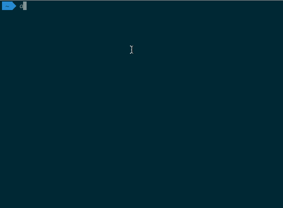

# super-adb

用busybox加持的功能更加强大的adb shell；不需要root。

## 使用方法

### 准备工作

1. 安装 [python](https://www.python.org/)，注意选择安装python 2.x
2. 安装pexpect这个python库：

    `pip install pexpect`

3. 下载super_adb，把它放到系统路径

    `cp super_adb /usr/local/bin`

### 使用方法

用 `super_adb`这个命令替代`adb shell`这个命令即可。

## 效果图

